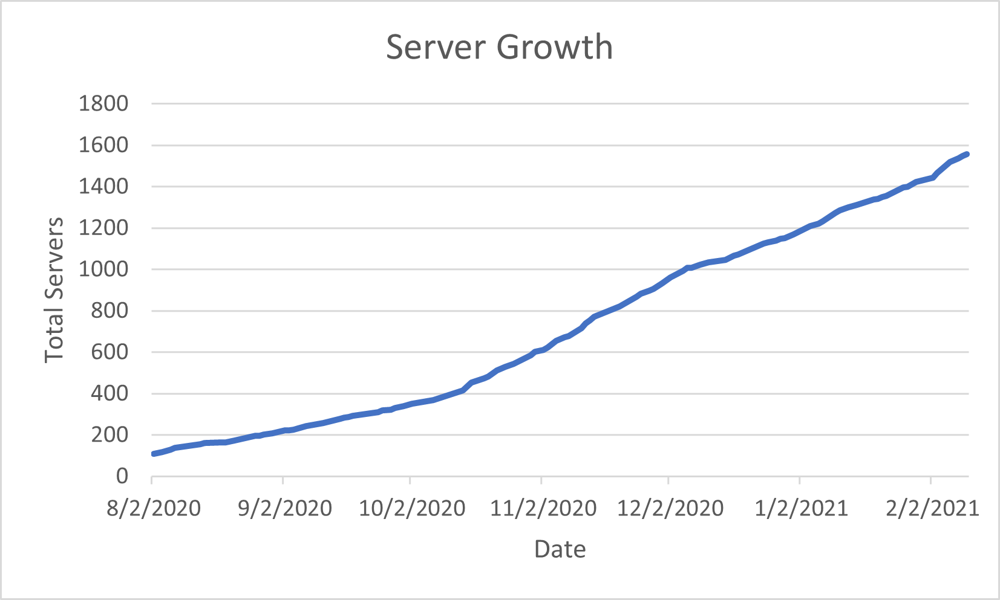
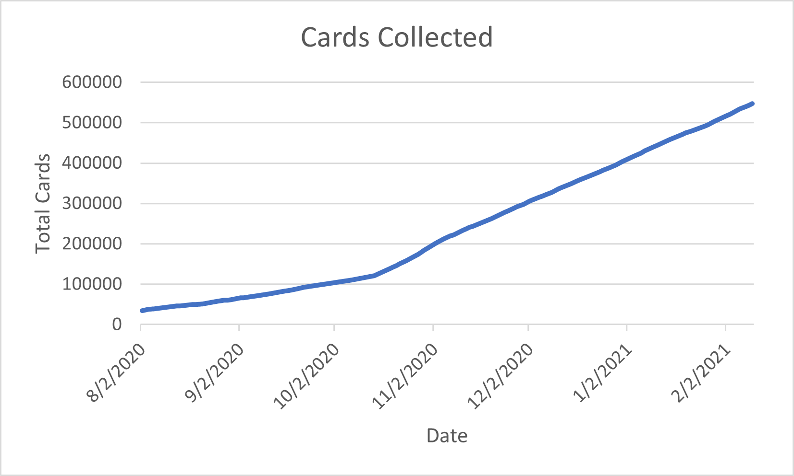
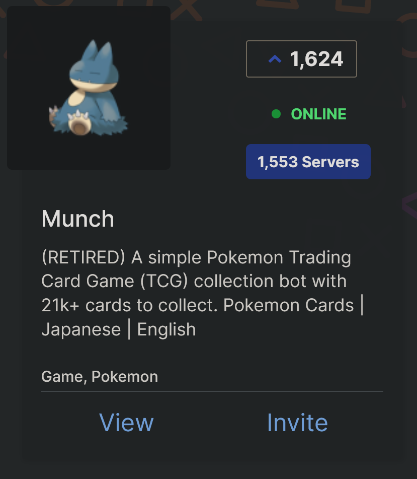

# Pokemon TCG Discord Bot - Python, Google Cloud, AWS, MySQL

Stopped maintaining and hosting on 2/10/21. Was used in 1500+ servers with over 500,000 cards collected.

## Stats

## About

A Discord bot running in an AWS EC2/Google Cloud VM and using RDS to store data of users and important information needed. Also using AWS Lambda and DynamoDB for some functionalities.

A simple Discord bot that allows users to collect and trade over 21k+ Pokemon cards. Currently used in 1500+ servers with thousands of users using the bot.

## References

When the bot was used in over 700+ servers, a simple host using Rapptz/discord.py was unusable (10+ minutes startup time and errors -- can look at previous commits to see how I implemented the bot). As I was busy with classes, I simply used the structure of , and modified it to use my cogs and a MySQL database to fix the problem. Specifically, bot.py and launcher.py was the fix, and I also added in helpers/ because it was helpful.
